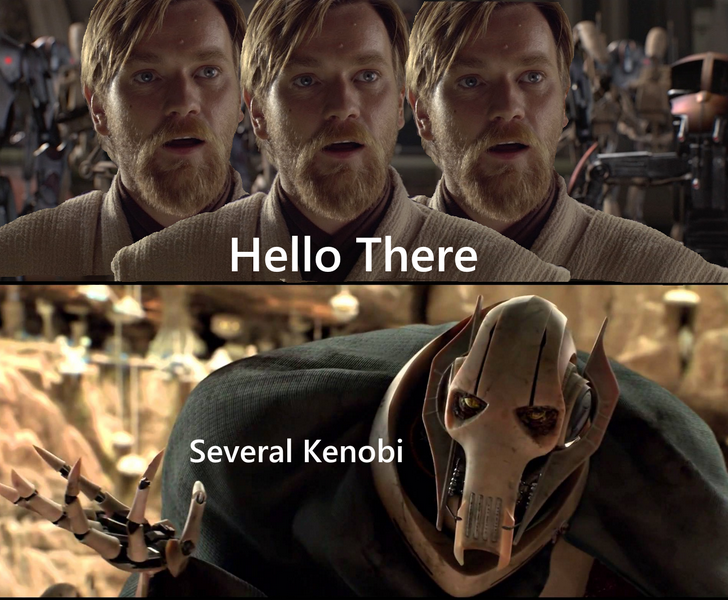

    

<h1 align="center">
    <a href="https://tibo-mouss.github.io/?ref=github">
        〰 〰 〰 📜 Portfolio 📜 〰 〰 〰 
    </a>
       
</h1>

<h2>
    • 💻 Working at <a href="https://www.justwatch.com"> Justwatch </a> during the day 
       
    • 🎮 Working on Esports Events at Night 🦹‍♂️
       
    • 🐱‍👤 One day I'll do great stuff
       
</h2>

    <picture>
    <source
        srcset="https://github-readme-stats-three-flax-64.vercel.app/api?username=Tibo-Mouss&show_icons=true&theme=radical"
        media="(prefers-color-scheme: dark)"
    />
    <source
        srcset="https://github-readme-stats-three-flax-64.vercel.app/api?username=Tibo-Mouss&show_icons=true&theme=tokyonight"
        media="(prefers-color-scheme: light), (prefers-color-scheme: no-preference)"
    />
    
    </picture> 

    <picture>
    <source
        srcset="https://github-readme-stats-three-flax-64.vercel.app/api/top-langs/?username=Tibo-Mouss&layout=donut&theme=radical"
        media="(prefers-color-scheme: dark)"
    />
    <source
        srcset="https://github-readme-stats-three-flax-64.vercel.app/api?username=Tibo-Mouss&show_icons=true&theme=tokyonight"
        media="(prefers-color-scheme: light), (prefers-color-scheme: no-preference)"
    />
    
    </picture>   

    

